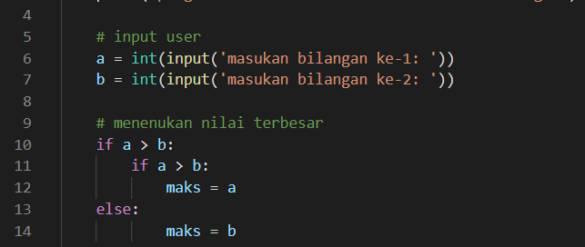
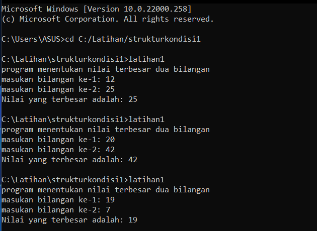

# struktur kondisi
## Latihan 1
### Program sederhana menentukan bilangan terbesar

### If statement
#### disini saya buat program sederhana seperti dibawah ini

dimana jika :
masukan bilangan ke-1
masukan bilangan ke-2
maka secara otomatis akan menentukan nilai terbesarnya

#### Hasil program

### Sekian terima kasih